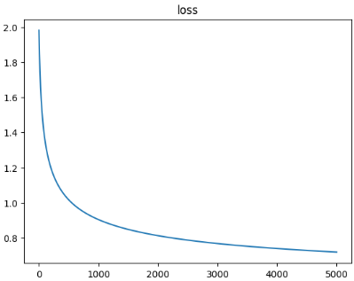
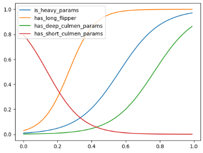

# Jazzy
Jazzy is an experimental one-page module designed for implementing fuzzy logic in JAX, with a specific focus on addressing challenges in high-expertise domains. The module comprises two main components: `jazzy.py`, which defines the fuzzy system, and `penguins.py`, a practical demonstration on a simple classification task.

Jazzy facilitates the transition from a domain understanding of the problem, with loosely defined rules, to a functioning classifier by enabling the tuning of thresholds and fuzziness in the membership functions.

Feel free to adapt and extend Jazzy for your specific use cases, and contribute to its evolution!

## Why ?

In high-expertise domains, practitioners often possess a nuanced understanding of a problem and formulate mental models to capture complex decision-making processes. However, translating these mental models into operational algorithms can be challenging, especially when dealing with imprecise or uncertain information. The motivation behind Jazzy is to bridge this gap by providing a tool that allows experts to leverage their existing mental models directly.

Fuzzy logic, known for handling imprecision and uncertainty, is particularly well-suited for this task. By implementing fuzzy logic in JAX (a library for differentiable programming), Jazzy enables the fine-tuning of existing mental models by making them differentiable. This approach allows for easy adjustments of thresholds and fuzziness in a way that aligns with an expert's domain-specific knowledge.

## Fuzzy system

### Zadeh Operators
Jazzy utilizes Zadeh operators as the foundation for its fuzzy system. LogSumExp is employed as the max operator, and 1 complement serves as the not operator. These operators are fundamental in combining and negating fuzzy sets, forming the backbone of fuzzy logic computations.

### Fuzzifiers
The fuzzification process, essential in translating numerical inputs into fuzzy sets, relies on weighted and offset sigmoid functions. These functions are designed to mimic linguistic variables and provide a smooth and differentiable mapping of input values to membership degrees within fuzzy sets. This approach captures the uncertainty inherent in imprecise information.

### Fuzzy System in Action
The provided code snippet demonstrates the application of fuzzy logic in a classification task. The fuzzy system processes inputs through fuzzy membership functions and applies domain logic using fuzzy AND, OR, and NOT operations. The final step involves de-fuzzification to obtain probabilities output values, which are then used to optimise the thresholds.

## Snippets

### Fuzzy system definition

```python
# fuzzify to get membership
is_heavy = gt_fuzzifier(body_mass, self.is_heavy_params)
has_long_flipper = gt_fuzzifier(flipper_length, self.has_long_flipper_params)
has_deep_culmen = gt_fuzzifier(culmen_depth, self.has_deep_culmen_params)
has_short_culmen = lt_fuzzifier(culmen_length, self.has_short_culmen_params)

# domain logic
is_gentoo = fuzzy_and(fuzzy_or(has_deep_culmen, is_heavy), has_long_flipper)
is_adelie = fuzzy_and(fuzzy_not(is_gentoo), has_short_culmen)
is_chinstrap = fuzzy_and(fuzzy_not(is_gentoo), fuzzy_not(is_adelie))

# De-fuzzification
indics = jax.numpy.stack((is_adelie, is_chinstrap, is_gentoo))
probas = indics / indics.sum()
```

### Results After training

After training the above logical circuit (tune the smoothness penalty with care), we obtain the following resutls:



```
              precision    recall  f1-score   support

      Adelie       0.71      1.00      0.83        34
   Chinstrap       1.00      0.27      0.42        15
      Gentoo       0.96      0.86      0.91        28

    accuracy                           0.81        77
   macro avg       0.89      0.71      0.72        77
weighted avg       0.86      0.81      0.78        77
```



